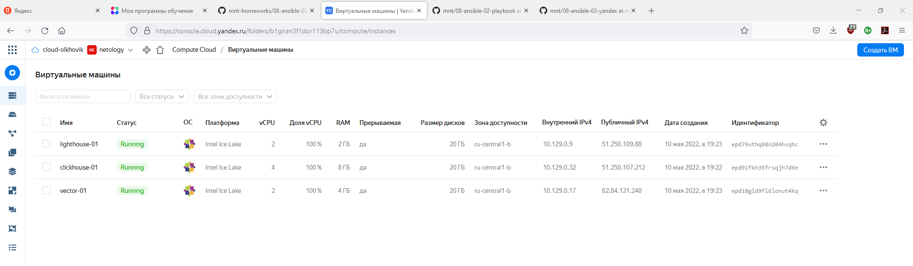

# Домашняя работа к занятию 8.3 «Использование Yandex Cloud»

## Подготовка к выполнению

1. Подготовьте в Yandex Cloud три хоста: для `clickhouse`, для `vector` и для `lighthouse`.

Создал и запустил в Yandex Cloud 3 виртуальные машины:


## Основная часть

1. Допишите playbook: нужно сделать ещё один play, который устанавливает и настраивает lighthouse.
2. При создании tasks рекомендую использовать модули: `get_url`, `template`, `yum`, `apt`.
3. Tasks должны: скачать статику lighthouse, установить nginx или любой другой webserver, настроить его конфиг для открытия lighthouse, запустить webserver.
- конфиги переменных:

`group_vars/clickhouse.yml`:
```
---
clickhouse_version: "22.3.3.44"
clickhouse_packages:
  - clickhouse-client
  - clickhouse-server
  - clickhouse-common-static
```
`group_vars/lighthouse.yml`:
```
---
lighthouse_vcs: https://github.com/VKCOM/lighthouse.git
lighthouse_access_log_name: lighthouse_access
lighthouse_location_dir: /home/dmitry/lighthouse
nginx_user_name: root
```
`group_vars/vector.yml`:
```
---
vector_version: "0.21.2"
vector_url: https://packages.timber.io/vector/{{ vector_version }}/vector-{{ vector_version }}-1.x86_64.rpm
vector_config:
  sources:
    our_log:
      type: file
      read_from: beginning
      ignore_older_secs: 600
      include:
      - /home/dmitry/logs/*.log
  sinks:
    to_clickhouse:
      type: clickhouse
      inputs:
        - our_log
      database: custom
      endpoint: http://51.250.107.212:8123
      table: my_table
      compression: gzip
      healthcheck: false
      skip_unknown_fields: true
```
- шаблоны конфигов:

`templates/lighthouse.conf.j2`:
```
server {
    listen    80;
    server_name  localhost;

    access_log /var/log/nginx/{{ lighthouse_access_log_name }}.log main;

    location / {
        root   {{ lighthouse_location_dir }};
        index  index.html;
    }
}
```
`templates/nginx.conf.j2`:
```
user {{ nginx_user_name }};
worker_processes 1;

error_log /var/log/nginx/error.log warn;
pid       /var/run/nginx.pid;


events {
    worker_connections 1024;
}


http {

    include /etc/nginx/mime.types;
    default_type application/octet-stream;

    log_format  main  '$remote_addr - $remote_user [$time_local] "$request" '
                      '$status $body_bytes_sent "$http_referer" '
                      '"$http_user_agent" "$http_x_forwarded_for"';

    access_log  /var/log/nginx/access.log  main;

    sendfile        on;
    #tcp_nopush     on;

    keepalive_timeout  65;

    #gzip  on;

    include /etc/nginx/conf.d/*.conf;
}
```
`templates/vector.service.j2`:
```
[Unit]
Description=Vector service
After=network.target
Requires=network-online.target
[Service]
User={{ ansible_user_id }}
Group={{ ansible_user_gid }}
ExecStart=/usr/bin/vector --config.yaml vector.yaml watch-config true
Restart=always
[Install]
WantedBy=multi-user.target
```
`templates/vector.yml.j2`:

`{{ vector_config | to_nice_yaml }}`

- playbook `site.yml` c play для установки `lighthouse + nginx`, `vector`, `clickhouse`:
```
---
- name: Install nginx
  hosts: lighthouse
  handlers:
    - name: start-nginx
      become: true
      command: nginx
    - name: reload-nginx
      become: true
      command: nginx -s reload
  tasks:
    - name: NGINX | Install epel-release
      become: true
      ansible.builtin.yum:
        name: epel-release
        state: present
      tags: nginx
    - name: NGINX | Install NGINX
      become: true
      ansible.builtin.yum:
        name: nginx
        state: present
      notify: start-nginx
      tags: nginx
    - name: NGINX | Create general config
      become: true
      template:
        src: templates/nginx.conf.j2
        dest: /etc/nginx/nginx.conf
        mode: 0644
      notify: reload-nginx
      tags: nginx
- name: Install lighthouse
  hosts: lighthouse
  handlers:
    - name: reload-nginx
      become: true
      command: nginx -s reload
  pre_tasks:
    - name: Lighthouse | install dependencies
      become: true
      ansible.builtin.yum:
        name: git
        state: present
  tasks:
    - name: Lighthouse | Copy from git
      git:
        repo: "{{ lighthouse_vcs }}"
        version: master
        dest: "{{ lighthouse_location_dir  }}"
      tags: lighthouse
    - name: Lighthouse | Create lighthouse config
      become: true
      template:
        src: templates/lighthouse.conf.j2
        dest: /etc/nginx/conf.d/default.conf
        mode: 0644
      notify: reload-nginx
      tags: lighthouse
      
      ...
      
- name: Install Vector
  hosts: vector
  tasks:
    - name: Vector | Install rpm
      become: true
      ansible.builtin.yum:
        name: "{{ vector_url }}"
        state: present
      tags: vector
    - name: Vector | Template config
      ansible.builtin.template:
        src: vector.yml.j2
        dest: vector.yml
        mode: "644"
        owner: "{{ ansible_user_id }}"
        group: "{{ ansible_user_gid }}"
        validate: vector validate --no-environment --config-yaml %s
      tags: vector
    - name: Vector | create systemd unit
      become: true
      ansible.builtin.template:
        src: vector.service.j2
        dest: /etc/systemd/system/vector.service
        mode: "644"
        owner: "{{ ansible_user_id }}"
        group: "{{ ansible_user_gid }}"
      tags: vector
    - name: Vector | Start service
      become: true
      ansible.builtin.systemd:
        name: vector
        state: started
        daemon_reload: true
      tags: vector

```

4. Приготовьте свой собственный inventory файл `prod.yml`.
```
---
clickhouse:
  hosts:
    clickhouse-01:
      ansible_host: 51.250.107.212
lighthouse:
  hosts:
    lighthouse-01:
      ansible_host: 51.250.109.88
vector:
  hosts:
    vector-01:
      ansible_host: 62.84.121.248

```
5. Запустите `ansible-lint site.yml` и исправьте ошибки, если они есть.

ошибок не было

7. Попробуйте запустить playbook на этом окружении с флагом `--check`.
```
dmitry@Lenovo-B50:~/netology/mnt/08-ansible-03-yandex$ ansible-playbook -i inventory/prod.yml site.yml --check

PLAY [Install nginx] ************************************************************************************************************************************************************************************************************************

TASK [Gathering Facts] **********************************************************************************************************************************************************************************************************************
ok: [lighthouse-01]

TASK [NGINX | Install epel-release] *********************************************************************************************************************************************************************************************************
changed: [lighthouse-01]

TASK [NGINX | Install NGINX] ****************************************************************************************************************************************************************************************************************
fatal: [lighthouse-01]: FAILED! => {"changed": false, "msg": "No package matching 'nginx' found available, installed or updated", "rc": 126, "results": ["No package matching 'nginx' found available, installed or updated"]}

PLAY RECAP **********************************************************************************************************************************************************************************************************************************
lighthouse-01              : ok=2    changed=1    unreachable=0    failed=1    skipped=0    rescued=0    ignored=0
```
выполнение остановилось из-за того, что NGINX не успел установиться

8. Запустите playbook на `prod.yml` окружении с флагом `--diff`. Убедитесь, что изменения на системе произведены.
```
dmitry@Lenovo-B50:~/netology/mnt/08-ansible-03-yandex$ ansible-playbook -i inventory/prod.yml site.yml --diff

PLAY [Install nginx] ************************************************************************************************************************************************************************************************************************

TASK [Gathering Facts] **********************************************************************************************************************************************************************************************************************
ok: [lighthouse-01]

TASK [NGINX | Install epel-release] *********************************************************************************************************************************************************************************************************
changed: [lighthouse-01]

TASK [NGINX | Install NGINX] ****************************************************************************************************************************************************************************************************************
changed: [lighthouse-01]

TASK [NGINX | Create general config] ********************************************************************************************************************************************************************************************************
--- before: /etc/nginx/nginx.conf
+++ after: /home/dmitry/.ansible/tmp/ansible-local-730014yqyxyaqs/tmpclzpdmww/nginx.conf.j2
@@ -1,84 +1,33 @@
-# For more information on configuration, see:
-#   * Official English Documentation: http://nginx.org/en/docs/
-#   * Official Russian Documentation: http://nginx.org/ru/docs/
+user root;
+worker_processes 1;

-user nginx;
-worker_processes auto;
-error_log /var/log/nginx/error.log;
-pid /run/nginx.pid;
+error_log /var/log/nginx/error.log warn;
+pid       /var/run/nginx.pid;

-# Load dynamic modules. See /usr/share/doc/nginx/README.dynamic.
-include /usr/share/nginx/modules/*.conf;

 events {
     worker_connections 1024;
 }

+
 http {
+
+    include /etc/nginx/mime.types;
+    default_type application/octet-stream;
+
     log_format  main  '$remote_addr - $remote_user [$time_local] "$request" '
                       '$status $body_bytes_sent "$http_referer" '
                       '"$http_user_agent" "$http_x_forwarded_for"';

     access_log  /var/log/nginx/access.log  main;
+
+    sendfile        on;
+    #tcp_nopush     on;

-    sendfile            on;
-    tcp_nopush          on;
-    tcp_nodelay         on;
-    keepalive_timeout   65;
-    types_hash_max_size 4096;
+    keepalive_timeout  65;

-    include             /etc/nginx/mime.types;
-    default_type        application/octet-stream;
+    #gzip  on;

-    # Load modular configuration files from the /etc/nginx/conf.d directory.
-    # See http://nginx.org/en/docs/ngx_core_module.html#include
-    # for more information.
     include /etc/nginx/conf.d/*.conf;
-
-    server {
-        listen       80;
-        listen       [::]:80;
-        server_name  _;
-        root         /usr/share/nginx/html;
-
-        # Load configuration files for the default server block.
-        include /etc/nginx/default.d/*.conf;
-
-        error_page 404 /404.html;
-        location = /404.html {
-        }
-
-        error_page 500 502 503 504 /50x.html;
-        location = /50x.html {
-        }
-    }
-
-# Settings for a TLS enabled server.
-#
-#    server {
-#        listen       443 ssl http2;
-#        listen       [::]:443 ssl http2;
-#        server_name  _;
-#        root         /usr/share/nginx/html;
-#
-#        ssl_certificate "/etc/pki/nginx/server.crt";
-#        ssl_certificate_key "/etc/pki/nginx/private/server.key";
-#        ssl_session_cache shared:SSL:1m;
-#        ssl_session_timeout  10m;
-#        ssl_ciphers HIGH:!aNULL:!MD5;
-#        ssl_prefer_server_ciphers on;
-#
-#        # Load configuration files for the default server block.
-#        include /etc/nginx/default.d/*.conf;
-#
-#        error_page 404 /404.html;
-#            location = /40x.html {
-#        }
-#
-#        error_page 500 502 503 504 /50x.html;
-#            location = /50x.html {
-#        }
-#    }
-
 }


changed: [lighthouse-01]

RUNNING HANDLER [start-nginx] ***************************************************************************************************************************************************************************************************************
changed: [lighthouse-01]

RUNNING HANDLER [reload-nginx] **************************************************************************************************************************************************************************************************************
changed: [lighthouse-01]

PLAY [Install lighthouse] *******************************************************************************************************************************************************************************************************************

TASK [Gathering Facts] **********************************************************************************************************************************************************************************************************************
ok: [lighthouse-01]

TASK [Lighthouse | install dependencies] ****************************************************************************************************************************************************************************************************
changed: [lighthouse-01]

TASK [Lighthouse | Copy from git] ***********************************************************************************************************************************************************************************************************
>> Newly checked out d701335c25cd1bb9b5155711190bad8ab852c2ce
changed: [lighthouse-01]

TASK [Lighthouse | Create lighthouse config] ************************************************************************************************************************************************************************************************
--- before
+++ after: /home/dmitry/.ansible/tmp/ansible-local-730014yqyxyaqs/tmp03z5a8ih/lighthouse.conf.j2
@@ -0,0 +1,11 @@
+server {
+    listen    80;
+    server_name  localhost;
+
+    access_log /var/log/nginx/lighthouse_access.log main;
+
+    location / {
+        root   /home/dmitry/lighthouse;
+        index  index.html;
+    }
+}

changed: [lighthouse-01]

RUNNING HANDLER [reload-nginx] **************************************************************************************************************************************************************************************************************
changed: [lighthouse-01]

PLAY [Install Clickhouse] *******************************************************************************************************************************************************************************************************************

TASK [Gathering Facts] **********************************************************************************************************************************************************************************************************************
ok: [clickhouse-01]

TASK [Get clickhouse distrib] ***************************************************************************************************************************************************************************************************************
changed: [clickhouse-01] => (item=clickhouse-client)
changed: [clickhouse-01] => (item=clickhouse-server)
failed: [clickhouse-01] (item=clickhouse-common-static) => {"ansible_loop_var": "item", "changed": false, "dest": "./clickhouse-common-static-22.3.3.44.rpm", "elapsed": 0, "item": "clickhouse-common-static", "msg": "Request failed", "response": "HTTP Error 404: Not Found", "status_code": 404, "url": "https://packages.clickhouse.com/rpm/stable/clickhouse-common-static-22.3.3.44.noarch.rpm"}

TASK [Get clickhouse distrib] ***************************************************************************************************************************************************************************************************************
changed: [clickhouse-01]

TASK [Install clickhouse packages] **********************************************************************************************************************************************************************************************************
changed: [clickhouse-01]

TASK [Flush handlers] ***********************************************************************************************************************************************************************************************************************

RUNNING HANDLER [Start clickhouse service] **************************************************************************************************************************************************************************************************
changed: [clickhouse-01]

TASK [Create database] **********************************************************************************************************************************************************************************************************************
changed: [clickhouse-01]

PLAY [Install Vector] ***********************************************************************************************************************************************************************************************************************

TASK [Gathering Facts] **********************************************************************************************************************************************************************************************************************
ok: [vector-01]

TASK [Vector | Install rpm] *****************************************************************************************************************************************************************************************************************
changed: [vector-01]

TASK [Vector | Template config] *************************************************************************************************************************************************************************************************************
--- before
+++ after: /home/dmitry/.ansible/tmp/ansible-local-730014yqyxyaqs/tmplbf2d529/vector.yml.j2
@@ -0,0 +1,18 @@
+sinks:
+    to_clickhouse:
+        compression: gzip
+        database: custom
+        endpoint: http://84.201.137.70:8123
+        healthcheck: false
+        inputs:
+        - our_log
+        skip_unknown_fields: true
+        table: my_table
+        type: clickhouse
+sources:
+    our_log:
+        ignore_older_secs: 600
+        include:
+        - /home/dmitry/logs/*.log
+        read_from: beginning
+        type: file

changed: [vector-01]

TASK [Vector | create systemd unit] *********************************************************************************************************************************************************************************************************
--- before
+++ after: /home/dmitry/.ansible/tmp/ansible-local-730014yqyxyaqs/tmptnem9w5z/vector.service.j2
@@ -0,0 +1,12 @@
+[Unit]
+Description=Vector service
+After=network.target
+Requires=network-online.target
+[Service]
+User=dmitry
+Group=1000
+ExecStart=/usr/bin/vector --config.yaml vector.yaml watch-config true
+Restart=always
+[Install]
+WantedBy=multi-user.target
+

changed: [vector-01]

TASK [Vector | Start service] ***************************************************************************************************************************************************************************************************************
changed: [vector-01]

PLAY RECAP **********************************************************************************************************************************************************************************************************************************
clickhouse-01              : ok=5    changed=4    unreachable=0    failed=0    skipped=0    rescued=1    ignored=0
lighthouse-01              : ok=11   changed=9    unreachable=0    failed=0    skipped=0    rescued=0    ignored=0
vector-01                  : ok=5    changed=4    unreachable=0    failed=0    skipped=0    rescued=0    ignored=0
```
9. Повторно запустите playbook с флагом `--diff` и убедитесь, что playbook идемпотентен.
```
dmitry@Lenovo-B50:~/netology/mnt/08-ansible-03-yandex$ ansible-playbook -i inventory/prod.yml site.yml --diff

PLAY [Install nginx] ************************************************************************************************************************************************************************************************************************

TASK [Gathering Facts] **********************************************************************************************************************************************************************************************************************
ok: [lighthouse-01]

TASK [NGINX | Install epel-release] *********************************************************************************************************************************************************************************************************
ok: [lighthouse-01]

TASK [NGINX | Install NGINX] ****************************************************************************************************************************************************************************************************************
ok: [lighthouse-01]

TASK [NGINX | Create general config] ********************************************************************************************************************************************************************************************************
ok: [lighthouse-01]

PLAY [Install lighthouse] *******************************************************************************************************************************************************************************************************************

TASK [Gathering Facts] **********************************************************************************************************************************************************************************************************************
ok: [lighthouse-01]

TASK [Lighthouse | install dependencies] ****************************************************************************************************************************************************************************************************
ok: [lighthouse-01]

TASK [Lighthouse | Copy from git] ***********************************************************************************************************************************************************************************************************
ok: [lighthouse-01]

TASK [Lighthouse | Create lighthouse config] ************************************************************************************************************************************************************************************************
ok: [lighthouse-01]

PLAY [Install Clickhouse] *******************************************************************************************************************************************************************************************************************

TASK [Gathering Facts] **********************************************************************************************************************************************************************************************************************
ok: [clickhouse-01]

TASK [Get clickhouse distrib] ***************************************************************************************************************************************************************************************************************
ok: [clickhouse-01] => (item=clickhouse-client)
ok: [clickhouse-01] => (item=clickhouse-server)
failed: [clickhouse-01] (item=clickhouse-common-static) => {"ansible_loop_var": "item", "changed": false, "dest": "./clickhouse-common-static-22.3.3.44.rpm", "elapsed": 0, "gid": 1000, "group": "dmitry", "item": "clickhouse-common-static", "mode": "0664", "msg": "Request failed", "owner": "dmitry", "response": "HTTP Error 404: Not Found", "secontext": "unconfined_u:object_r:user_home_t:s0", "size": 246310036, "state": "file", "status_code": 404, "uid": 1000, "url": "https://packages.clickhouse.com/rpm/stable/clickhouse-common-static-22.3.3.44.noarch.rpm"}

TASK [Get clickhouse distrib] ***************************************************************************************************************************************************************************************************************
ok: [clickhouse-01]

TASK [Install clickhouse packages] **********************************************************************************************************************************************************************************************************
ok: [clickhouse-01]

TASK [Flush handlers] ***********************************************************************************************************************************************************************************************************************

TASK [Create database] **********************************************************************************************************************************************************************************************************************
ok: [clickhouse-01]

PLAY [Install Vector] ***********************************************************************************************************************************************************************************************************************

TASK [Gathering Facts] **********************************************************************************************************************************************************************************************************************
ok: [vector-01]

TASK [Vector | Install rpm] *****************************************************************************************************************************************************************************************************************
ok: [vector-01]

TASK [Vector | Template config] *************************************************************************************************************************************************************************************************************
ok: [vector-01]

TASK [Vector | create systemd unit] *********************************************************************************************************************************************************************************************************
ok: [vector-01]

TASK [Vector | Start service] ***************************************************************************************************************************************************************************************************************
changed: [vector-01]

PLAY RECAP **********************************************************************************************************************************************************************************************************************************
clickhouse-01              : ok=4    changed=0    unreachable=0    failed=0    skipped=0    rescued=1    ignored=0
lighthouse-01              : ok=8    changed=0    unreachable=0    failed=0    skipped=0    rescued=0    ignored=0
vector-01                  : ok=5    changed=1    unreachable=0    failed=0    skipped=0    rescued=0    ignored=0
```
10. Подготовьте README.md файл по своему playbook. В нём должно быть описано: что делает playbook, какие у него есть параметры и теги.

https://github.com/olkhovik/ansible-8.3/blob/main/README.md

11. Готовый playbook выложите в свой репозиторий, поставьте тег `08-ansible-03-yandex` на фиксирующий коммит, в ответ предоставьте ссылку на него.

https://github.com/olkhovik/ansible-8.3


