# Домашняя работа к занятию 9.5 «Teamcity»

## Подготовка к выполнению

1. В Ya.Cloud создайте новый инстанс (4CPU4RAM) на основе образа `jetbrains/teamcity-server`
2. Дождитесь запуска teamcity, выполните первоначальную настройку
3. Создайте ещё один инстанс(2CPU4RAM) на основе образа `jetbrains/teamcity-agent`. Пропишите к нему переменную окружения `SERVER_URL: "http://<teamcity_url>:8111"`
4. Авторизуйте агент
5. Сделайте fork [репозитория](https://github.com/aragastmatb/example-teamcity)
6. Создать VM (2CPU4RAM) и запустить [playbook](./infrastructure)

## Основная часть

1. Создайте новый проект в teamcity на основе fork
2. Сделайте autodetect конфигурации
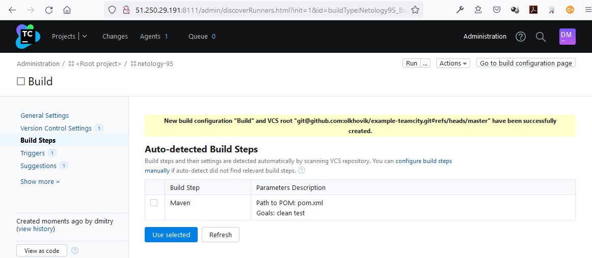
3. Сохраните необходимые шаги, запустите первую сборку master'a
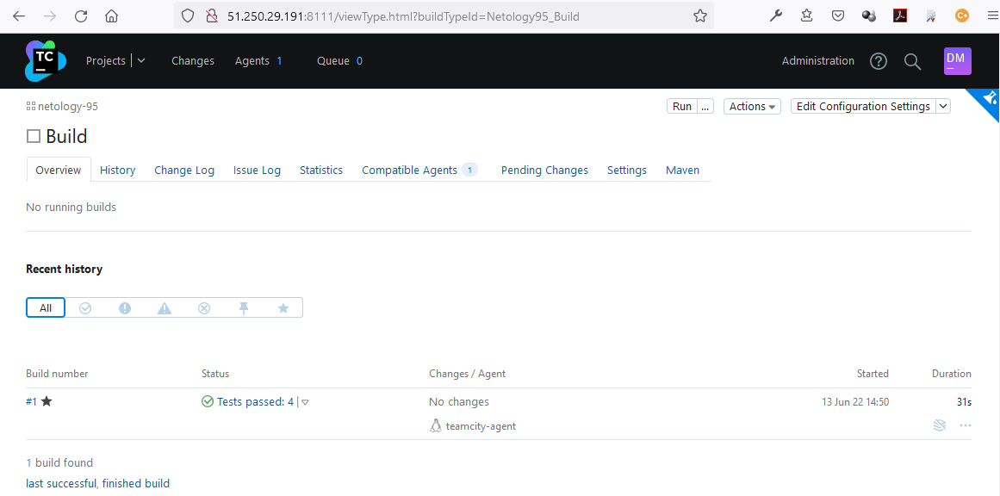
4. Поменяйте условия сборки: если сборка по ветке `master`, то должен происходит `mvn clean deploy`, иначе `mvn clean test`
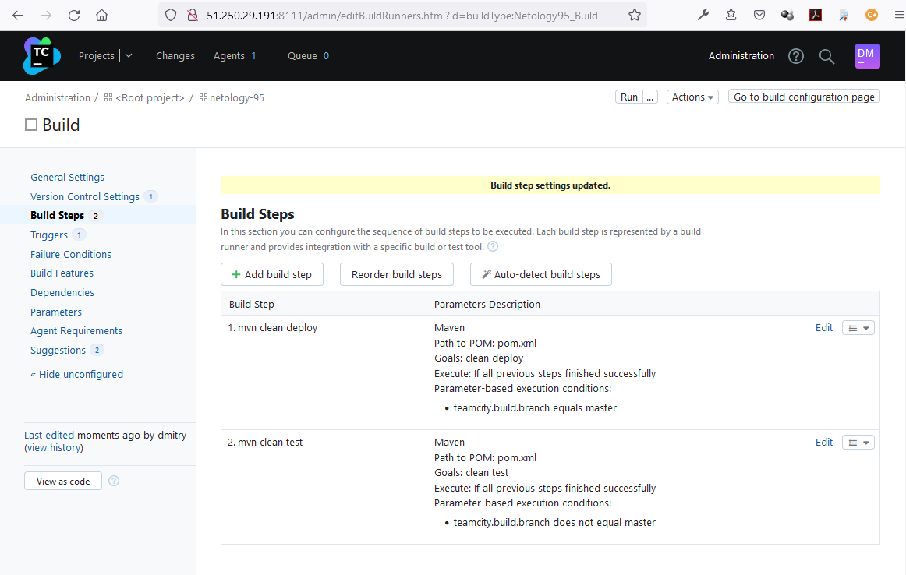
5. Для deploy будет необходимо загрузить [settings.xml](./teamcity/settings.xml) в набор конфигураций maven у teamcity, предварительно записав туда креды для подключения к nexus
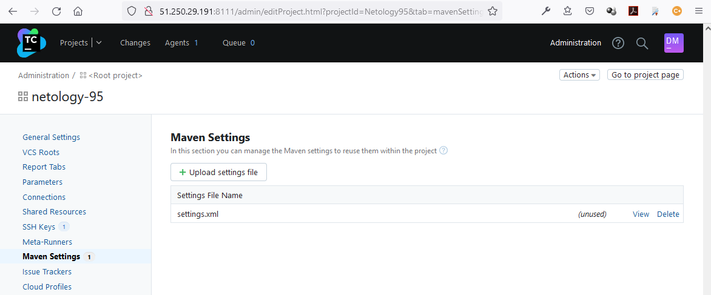
6. В pom.xml необходимо поменять ссылки на репозиторий и nexus

https://github.com/olkhovik/example-teamcity/commit/eba4c39832ddde57e66b53cf8d5d536aeeee31e2
```
dmitry@Lenovo-B50:~/netology/example-teamcity$ git show eba4c39
commit eba4c39832ddde57e66b53cf8d5d536aeeee31e2
Author: Dmitry Olkhovik <dmitry.olkhovik@gmail.com>
Date:   Mon Jun 13 19:14:37 2022 +0300

    поменял ссылки на репозиторий и nexus

diff --git a/pom.xml b/pom.xml
index 48b74ff..841810e 100644
--- a/pom.xml
+++ b/pom.xml
@@ -15,7 +15,7 @@
        <distributionManagement>
                <repository>
                                <id>nexus</id>
-                               <url>http://51.250.34.239:8081/repository/maven-releases</url>
+                               <url>http://51.250.107.222:8081/repository/maven-releases</url>
                </repository>
        </distributionManagement>
        <dependencies>
```
7. Запустите сборку по master, убедитесь что всё прошло успешно, артефакт появился в nexus
- [Лог сборки](./media/netology-95_Build_6.log)
- maven-releases в Nexus:
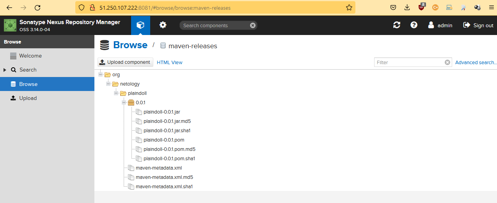
8. Мигрируйте `build configuration` в репозиторий
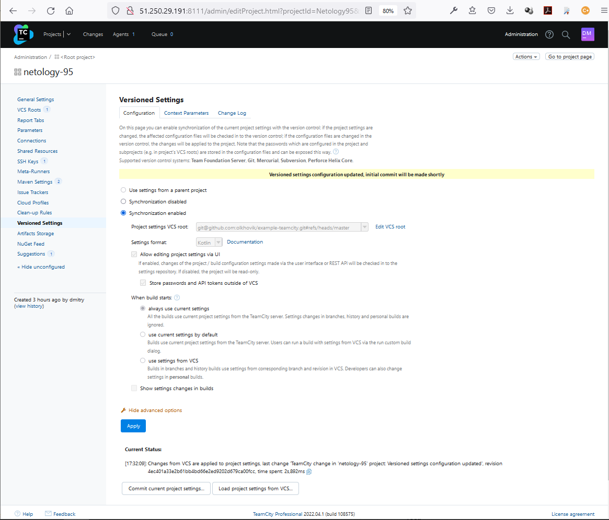
9. Создайте отдельную ветку `feature/add_reply` в репозитории
```
dmitry@Lenovo-B50:~/netology/example-teamcity$ git checkout -b feature/add_reply
Switched to a new branch 'feature/add_reply'
dmitry@Lenovo-B50:~/netology/example-teamcity$ git status
On branch feature/add_reply
nothing to commit, working tree clean
```
10. Напишите новый метод для класса Welcomer: метод должен возвращать произвольную реплику, содержащую слово `hunter`
```
public String sayHunters() {
                return "Today the best hunters have gathered here";
        }
```
11. Дополните тест для нового метода на поиск слова `hunter` в новой реплике
```
@Test
        public void welcomerSaysHunters(){
                assertThat(welcomer.sayHunters(), containsString("hunters"));
        }
```
12. Сделайте push всех изменений в новую ветку в репозиторий

https://github.com/olkhovik/example-teamcity/commit/dcbc9164627d8189afaa9e4f85c6793d427829c4
```
dmitry@Lenovo-B50:~/netology/example-teamcity$ git show dcbc916
commit dcbc9164627d8189afaa9e4f85c6793d427829c4 (origin/feature/add_reply, feature/add_reply)
Author: Dmitry Olkhovik <dmitry.olkhovik@gmail.com>
Date:   Mon Jun 13 21:14:24 2022 +0300

    new method and test

diff --git a/src/main/java/plaindoll/Welcomer.java b/src/main/java/plaindoll/Welcomer.java
index 66b394c..09ac9e4 100644
--- a/src/main/java/plaindoll/Welcomer.java
+++ b/src/main/java/plaindoll/Welcomer.java
@@ -7,7 +7,7 @@ public class Welcomer{
        public String sayFarewell() {
                return "Farewell, good hunter. May you find your worth in waking world.";
        }
-       public String sayNeedGold(){
-               return "Not enough gold";
-       }
+       public String sayHunters() {
+                return "Today the best hunters have gathered here";
+        }
 }
diff --git a/src/test/java/plaindoll/WelcomerTest.java b/src/test/java/plaindoll/WelcomerTest.java
index b8fb41d..46906f8 100644
--- a/src/test/java/plaindoll/WelcomerTest.java
+++ b/src/test/java/plaindoll/WelcomerTest.java
@@ -6,7 +6,7 @@ import static org.junit.Assert.*;
 import org.junit.Test;

 public class WelcomerTest {
-
+
        private Welcomer welcomer = new Welcomer();

        @Test
@@ -23,7 +23,7 @@ public class WelcomerTest {
                assertThat(welcomer.sayFarewell(), containsString("hunter"));
        }
        @Test
-       public void welcomerSaysSilver(){
-               assertThat(welcomer.sayNeedGold(), containsString("gold"));
-       }
-}
\ No newline at end of file
+        public void welcomerSaysHunters(){
+                assertThat(welcomer.sayHunters(), containsString("hunters"));
+        }
+}
```
13. Убедитесь что сборка самостоятельно запустилась, тесты прошли успешно

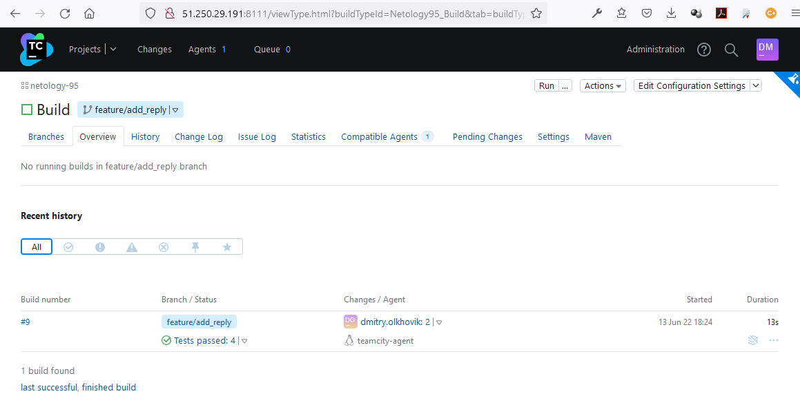

14. Внесите изменения из произвольной ветки `feature/add_reply` в `master` через `Merge`

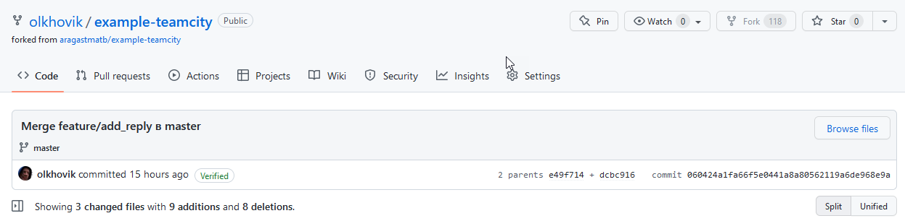

15. Убедитесь, что нет собранного артефакта в сборке по ветке `master`
16. Настройте конфигурацию так, чтобы она собирала `.jar` в артефакты сборки

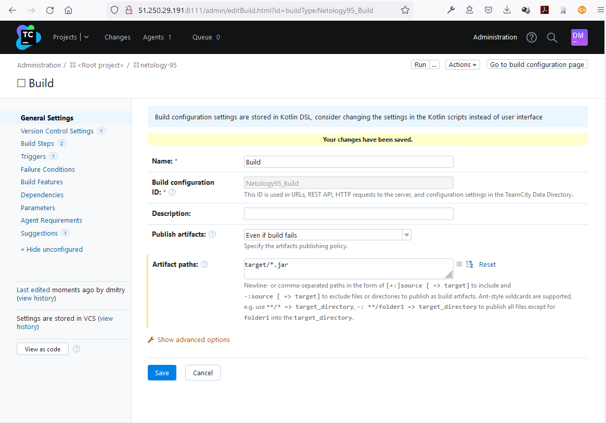
17. Проведите повторную сборку мастера, убедитесь, что сбора прошла успешно и артефакты собраны

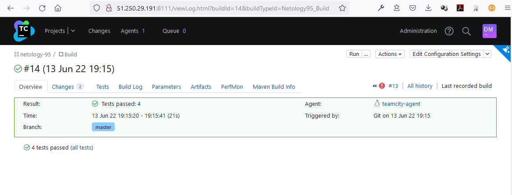
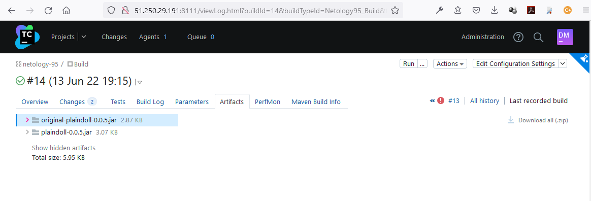
18. Проверьте, что конфигурация в репозитории содержит все настройки конфигурации из teamcity
- Коммит: https://github.com/olkhovik/example-teamcity/commit/1b1f3b03a86d97b31410939b668428cc282ef056
- Скриншот:
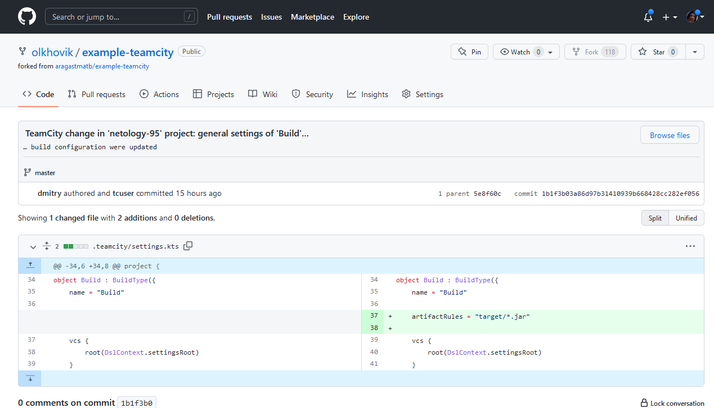
19. В ответ предоставьте ссылку на репозиторий

https://github.com/olkhovik/example-teamcity

