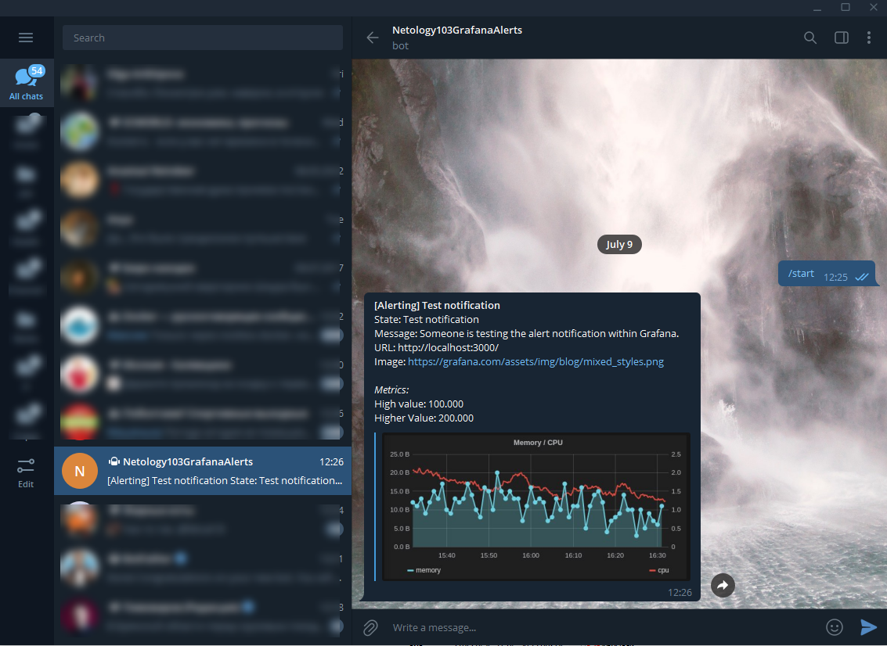
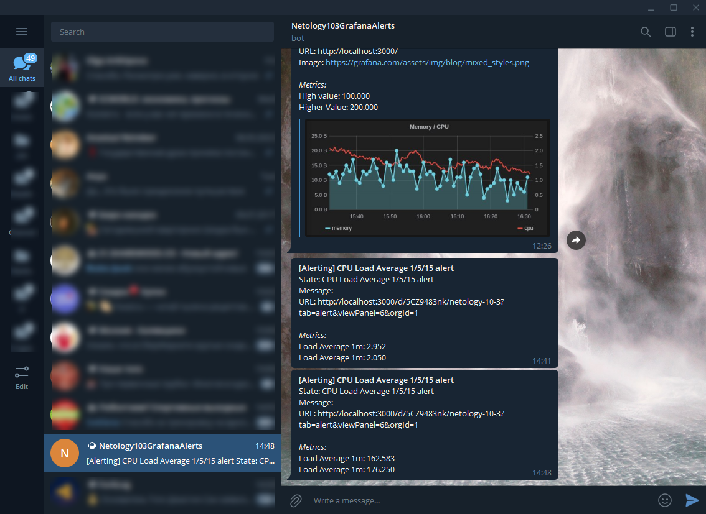
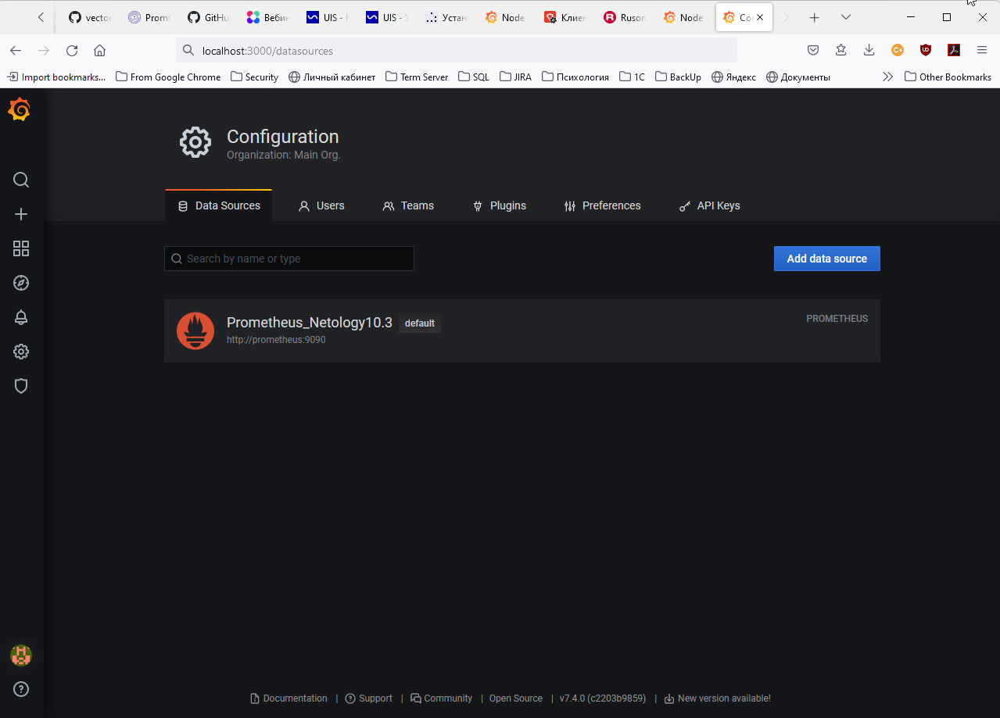

# Домашняя работа к занятию 10.3 «Grafana»

## Задание повышенной сложности

#### В решении к домашнему заданию приведите также все конфигурации/скрипты/манифесты, которые вы использовали в процессе решения задания:

<details><summary>.</summary>

>**В части задания 1** не используйте директорию [help](./help) для сборки проекта, самостоятельно разверните grafana, где в 
>роли источника данных будет выступать prometheus, а сборщиком данных node-exporter:
>- grafana
>- prometheus-server
>- prometheus node-exporter
>
>За дополнительными материалами, вы можете обратиться в официальную документацию grafana и prometheus.
>
>В решении к домашнему заданию приведите также все конфигурации/скрипты/манифесты, которые вы 
использовали в процессе решения задания.
</details>

[docker-compose](mystack/docker-compose.yml)

[Prometheus, конфиг prometheus.yml](mystack/prometheus.yml)

[Grafana, конфиг DataSource](mystack/prometheus_datasource.yml)

[Grafana, конфиг Dashboard](mystack/prometheus_dashboard_1860.yml)

[Grafana, Dashboard в json](mystack/prometheus_dashboard_1860.json)

#### Источники, которые помогли при выполнении задания:
<details><summary>.</summary>

`docker-compose`:
- [hub.docker.com, параметры для контейнера `prometheus`, как подключить `volume` для данных](https://hub.docker.com/r/prom/prometheus)
- [prometheus.io, настройка `node exporter`](https://prometheus.io/docs/guides/node-exporter/)
- [github.com, параметры контейнера `node exporter`](https://github.com/prometheus/node_exporter)
- [grafana.com, параметры контейнера `grafana`, как подключить `volume` для данных](https://grafana.com/docs/grafana/latest/administration/configure-docker/)

`Grafana`:
- [community.grafana.com, пример конфига DataSource prometheus](https://community.grafana.com/t/solved-datasource-provisioning-prometheus/6300/9)
- [grafana.com, документация как добавить Dashboard](https://grafana.com/tutorials/provision-dashboards-and-data-sources/)
- [medium.com, статья по связке grafana + prometheus](https://medium.com/56kcloud/provisioning-grafana-data-sources-and-dashboards-auto-magically-e27155d20652)
- [grafana.com, Dashboard  для данных из node_exporter](https://grafana.com/grafana/dashboards/1860)

Нотификации в Telegram:
- [youtube.com, видео с примером настройки нотификации через бота в Telegram](https://youtu.be/oNYLO11Pgv8)
</details>

#### скриншоты тестовых событий из каналов нотификаций:

<details><summary>.</summary>

>**В части задания 3** вы должны самостоятельно завести удобный для вас канал нотификации, например Telegram или Email
>и отправить туда тестовые события.
>
>В решении приведите скриншоты тестовых событий из каналов нотификаций.
</details>




## Обязательные задания

### Задание 1
<details><summary>.</summary>

>Используя директорию [help](./help) внутри данного домашнего задания - запустите связку prometheus-grafana.
>
>Зайдите в веб-интерфейс графана, используя авторизационные данные, указанные в манифесте docker-compose.
>
>Подключите поднятый вами prometheus как источник данных.
>
>Решение домашнего задания - скриншот веб-интерфейса grafana со списком подключенных Datasource.
</details>

- скриншот веб-интерфейса grafana со списком подключенных Datasource:


## Задание 2
<details><summary>.</summary>

>Изучите самостоятельно ресурсы:
>- [promql-for-humans](https://timber.io/blog/promql-for-humans/#cpu-usage-by-instance)
>- [understanding prometheus cpu metrics](https://www.robustperception.io/understanding-machine-cpu-usage)
>
>Создайте Dashboard и в ней создайте следующие Panels:
>- Утилизация CPU для nodeexporter (в процентах, 100-idle)
>- CPULA 1/5/15
>- Количество свободной оперативной памяти
>- Количество места на файловой системе
>
>Для решения данного ДЗ приведите promql запросы для выдачи этих метрик, а также скриншот получившейся Dashboard.
</details>

- Утилизация CPU для nodeexporter (в процентах, 100-idle):

```
sum by (mode)(rate(node_cpu_seconds_total{mode='idle',instance="nodeexporter:9100",job="nodeexporter"}[$__rate_interval])) * 100
```
- CPULA 1/5/15:
```
avg(node_load1{instance="nodeexporter:9100",job="nodeexporter"}) /  count(count(node_cpu_seconds_total{instance="nodeexporter:9100",job="nodeexporter"}) by (cpu)) * 100
avg(node_load5{instance="nodeexporter:9100",job="nodeexporter"}) /  count(count(node_cpu_seconds_total{instance="nodeexporter:9100",job="nodeexporter"}) by (cpu)) * 100
avg(node_load15{instance="nodeexporter:9100",job="nodeexporter"}) /  count(count(node_cpu_seconds_total{instance="nodeexporter:9100",job="nodeexporter"}) by (cpu)) * 100
```
- Количество свободной оперативной памяти:
```
node_memory_MemFree_bytes{instance="nodeexporter:9100",job="nodeexporter"}
node_memory_MemTotal_bytes{instance="nodeexporter:9100",job="nodeexporter"}
```
- Количество места на файловой системе:
```
node_filesystem_avail_bytes{instance="nodeexporter:9100",job="nodeexporter",device!~'rootfs'}
```
- скриншот получившейся Dashboard:


## Задание 3
>Создайте для каждой Dashboard подходящее правило alert (можно обратиться к первой лекции в блоке "Мониторинг").
>
>Для решения ДЗ - приведите скриншот вашей итоговой Dashboard.


## Задание 4
>Сохраните ваш Dashboard.
>
>Для этого перейдите в настройки Dashboard, выберите в боковом меню "JSON MODEL".
>
>Далее скопируйте отображаемое json-содержимое в отдельный файл и сохраните его.
>
>В решении задания - приведите листинг этого файла.

[Листинг .json Dashboard](media/dashboard_netology103.json)
